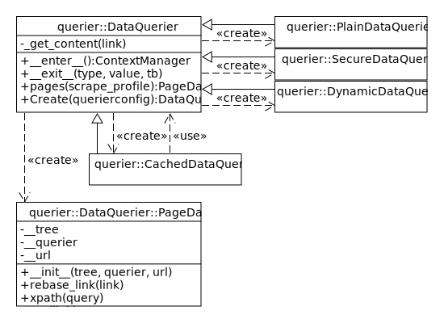

# downdrag

Webscraping done thoroughly. Python web scraping tool using [lxml](https://lxml.de/) and configured by [Confuse](https://confuse.readthedocs.io/en/latest/).

## model

The harvested information is first structured by those main fields:

- itemindex
- source
- index
- name
- description
- extrainfo
- link

## configuration

These are the main roots:

- querier
- outputs
- details
- profiles

### example

```YAML
outputs:
  csv:
    filename: scraping.csv
  mysql:
    connectioninfos:
      host: localhost
      port: 3306
      user: root
      password: 12345
      database: db
    tablename: scraping
  html:
    filename: scraping.html
    title: Scraping Table Export
    scripts:
    - default.js
    styles:
    - default.css
details:
  color:
    type: string
    conversion:
      process: value
      pattern: '^(red|green|blue)'
  size:
    default: 8
    type: int
    conversion:
      process: calculate
      pattern: '\b(\d+)x(\d+)\b'
      formula: '%s*%s'
  lot:
    type: float
    conversion:
      process: layer
      formula: 'size*23.5'
  delivery:
    conversion:
      process: schedule
      pattern: '\b[012]\d:[0-5]\d\b'
    source: extrainfo
profiles:
  warehouse:
    url: https://warehouse.com/
    items: //div[@class="item-box-info"]
    name: //div[@class="item-box-name"]/text()
    features: //div[@class="item-box-features"]/text()
    evaluator: ^\s*(.+)\s*$
    pathfinder:
      target: external
      link: https://warehouse.com/deliveries/
      type: fulltext
      pattern: '%D'
      indexer: startwith
      value: //div[@id="daily-schedules"]/descendant::text()
  library:
    url: https://library.com/
    items: //div[@class="item-book-info"]
    infos: //a[@class="item-details"]
    name: //div[@class="item-book-name"]/text()
    features: //div[@class="item-book-features"]/text()
    evaluator: ^\s*\w+: (.+)\s*$
    pathfinder:
      target: current
      type: showcase
      value: //div[@id="daily-signings"]/div[@id="%s"]/descendant::text()

```

### querier (optional, defaults to plain)

Mechanism of querying the data:

- mode: strategy of the querier
  - plain: (default)
  - secure: use Tor, needs to have torpy package installed
  - dynamic: use a selenium web driver
- driver: only for dynamic mode, one of Firefox, Chrome, Ie or WebKitGTK
- argsline: engine command line arguments, only for dynamic mode

### outputs

There's currently three types of output available:

- csv:
  - filename
- html
  - filename
  - title, optional
  - scripts: optional list of js filenames
  - styles: optional list of css filenames
- mysql (requires having the installation of mysql-connector-python package)
  - connectionsinfos: dict of [connect args](https://dev.mysql.com/doc/connector-python/en/connector-python-connectargs.html)
  - tablename

### details (optional)

Each of the gathered information can be modelled by:

- type: choice of save method
  - string (default)
  - int
  - float
- default: otherwise the type's default
- conversion: collection configuriton
  - process: choice of harvesting method
    - value: harvest directly
    - calculate: math formula from regex groups
    - layer: formula from previous fields
    - schedule: pair of time values on two fields
  - pattern: except for layer process
  - formula: for calculate and layer processes
- source: different field to harvest

### profiles

Multiple websites can be scraped.

- url: index page of the items
- pagers: XPath of element to next page or configuration for dynamic pagers
  - action: event to trigger
  - value: XPath of element to dynamic next page
- items: XPath list of elements
- infos: XPath of link to the element's details (defaults to the first link within the element)
- name: XPath text value
- features: XPath list of sub-elements
- evaluator: Regex to cleanup the value
- pathfinder: additional infos
  - target: choice of source for the infos
    - current
    - external
    - index: items list page
  - link: for external target
  - type: choice of format for the into, except for index
    - fulltext: simple text
    - showcase: html presentation
  - pattern: except for index or showcase
  - format: choice for structure of the infos if fulltext
    - now: current date and time
    - list: enumeration of items
  - indexer: string method for matching the line if fulltext
  - value: XPath text value, parametrized with name if index or showcase

## development

### outputs


### querier


